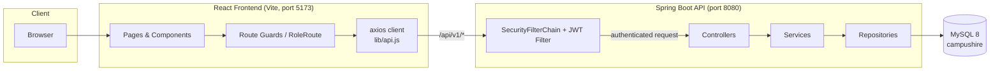
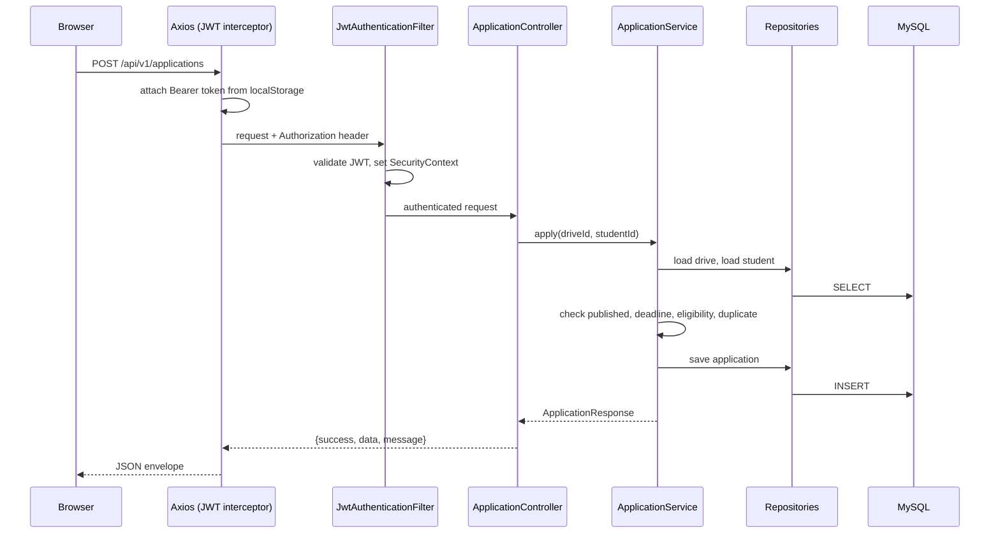

# Architecture Diagram

## Request Flow (e.g. student applies to a drive)

## Deployment / Runtime Topology

- **Backend**: Spring Boot 3, Tomcat embedded, JWT HS256, CORS allow-list for `FRONTEND_ORIGIN`.
- **Frontend**: Vite dev server proxies `/api` to `http://localhost:8080` (see `vite.config.js`).
- **Database**: MySQL 8, schema created by Hibernate (`ddl-auto: update`), seed via `DataSeeder`.
- **CI**: `backend.yml` (Maven clean verify), `frontend.yml` (lint + build), on push/PR to `main`.
