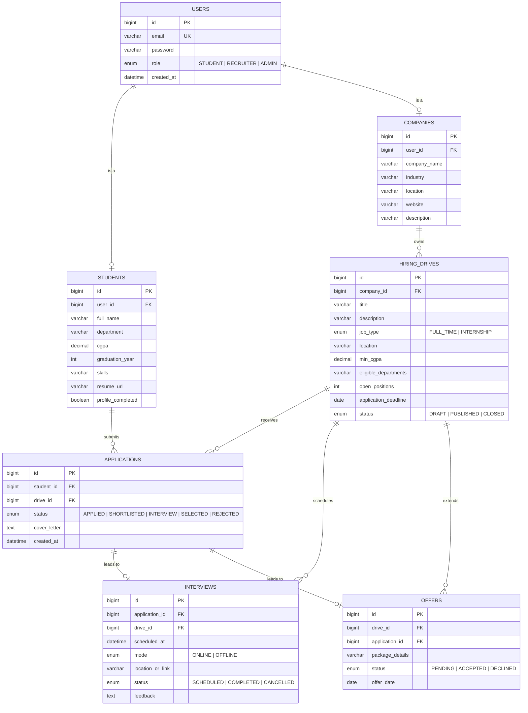

# Entity Relationship Diagram

## Notes

- `users` is the authentication root; `students` and `companies` extend it via a one-to-one `user_id` foreign key.
- A student may submit **one application per drive** (enforced in `ApplicationService`).
- `hiring_drives` visibility: `PUBLISHED` drives are public; drafts are recruiter-only.
- The `Interview` and `Offer` entities exist in the schema for the next milestone (Review-II).
